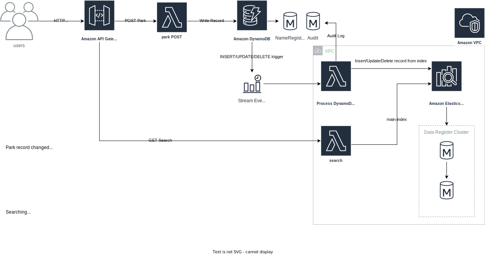

# Parks Data Register - API

# Introduction

This folder consists of the back end code for the Parks Data Register API. It contains source code and supporting files for a serverless application that you can deploy with the SAM CLI. 

The AWS resources for this project are defined in the `template.yaml` file.
Data models can be found in [/docs](https://github.com/bcgov/parks-data-register/tree/main/pdr-api/docs)

## OpenSearch System Integration




# Local Development

## Prerequisites

To use the SAM CLI, you need the following tools.

* SAM CLI - [Install the SAM CLI](https://docs.aws.amazon.com/serverless-application-model/latest/developerguide/install-sam-cli.html)
* Node.js - [Install Node.js 18](https://nodejs.org/en/), including the NPM package management tool.
* Docker - [Install Docker community edition](https://hub.docker.com/search/?type=edition&offering=community)

### DynamoDB Local

This project makes use of `dynamodb-local` for local development. You can start an instance of DyanmoDB using Docker.

```
docker run -d -p 8000:8000 --name dynamodb amazon/dynamodb-local -jar DynamoDBLocal.jar -sharedDb
```

### AWS Credentials

The AWS credentials `AWS_ACCESS_KEY_ID` and `AWS_SECRET_ACCESS_KEY` must exist in your environment as environment variables or in the `.aws` credential file. These values are used by the `aws-sdk` to instantiate sdk objects.

You can provide any value for them when using `dynamodb-local`. Real values are needed when performing operations on remote AWS services such as generating CAPTCHA audio using AWS Polly.

## Use the SAM CLI to build and test locally

Set the AWS Credentials:
   - AWS_ACCESS_KEY_ID
   - AWS_SECRET_ACCESS_KEY
   - AWS_SESSION_TOKEN
   - AWS_DEFAULT_REGION
   - AWS_REGION

Copy the [sample-env.json](docs/sample-env.json) file to the root of your local `pdr-api` folder and make changes according to your own personal set up. 

```
    "TABLE_NAME": "NameRegister", // local DynamoDB table name
    "IS_OFFLINE": true, // set to true if working offline
    "AWS_REGION": "local-env", // can be anything if working locally
    "DYNAMODB_ENDPOINT_URL": "http://172.17.0.1:8000", // local endpoint of your local dynamodb server
    "OPENSEARCH_DOMAIN_ENDPOINT": "http://localhost:9200", // local endpoint of your local opensearch server
    "OPENSEARCH_MAIN_INDEX": "main-index" // local OS index name
```

Navigate to the folder cotaining `template.yaml`

Build your application with the `sam build` command.

```bash
pdr-api$ sam build
```

Use the `sam local start-api` to run the API locally on port 3000.

```bash
pdr-api$ sam local start-api
pdr-api$ curl http://localhost:3000/
```

You can also use `yarn build` & `yarn start` to build and start the API locally. 

## Connecting to remote AWS DynamoDB endpoints (for migrations, etc)

DynamoDB functionality is universally inherited from `dynamodb` which is exported from [dynamoUtils](layers/dynamodb/dynamodb.js). By default, the DynamoDB endpoint is `dynamodb.<region>.amazonaws.com`, unless you have the local environment variable `IS_OFFLINE=true`. The `DYNAMODB_ENDPOINT_URL` environment variable determines which endpoint `dynamodb` will point to.

### Local connections
```
export IS_OFFLINE=true
export DYNAMODB_ENDPOINT_URL="http://172.17.0.1:8000" // local endpoint of your local dynamodb server
```

### Remote connections
```
unset IS_OFFLINE
export DYNAMODB_ENDPOINT_URL="dynamodb.ca-central-1.amazonaws.com" // remote endpoint for all dynamodb connections in ca-central-1
```

### Testing

Test a single function by invoking it directly with a test event. An event is a JSON document that represents the input that the function receives from the event source. Test events are included in the `events` folder in this project.

Run functions locally and invoke them with the `sam local invoke` command.

```bash
pdr-api$ sam local invoke HelloWorldFunction --event events/event.json
```

The SAM CLI reads the application template to determine the API's routes and the functions that they invoke. The `Events` property on each function's definition includes the route and method for each path.

```yaml
      Events:
        HelloWorld:
          Type: Api
          Properties:
            Path: /hello
            Method: get
```

Run the suite of unit tests with `yarn test`:

```bash
pdr-api$ yarn test
```

With SAM, lambda and layer dependencies are stored their respective `nodejs` folder upon running `sam build`, not the common `node_modules` folder. Since Jest looks for dependencies in the `node_modules` folder, a symlink is created in the build step so Jest can find layer dependencies outside of a SAM docker container environment. 

Because of this, dependency mapping does not exist prior to `sam build` and therefore `sam build` is included in the `yarn test` script.

Additionally, lambdas with layer dependencies import the layer using `require`:

```
const { layerFn } = require(/opt/layer);
```

The `/opt` directory is only available at runtime within the SAM docker container after running `sam build && sam local start-api`. Jest cannot be mapped to the `opt` directory. To work around this, Jest is configured to look for the respective layer resources using `moduleNameMapper`.

```package.json
"jest": {
  ...
  "moduleNameMapper": [
    "^/opt/dynamodb": "<rootDir>/.aws-sam/build/DynamoDBLayer/dynamodb",
    "^/opt/base": "<rootDir>/.aws-sam/build/BaseLayer/base",
    ...,
    "^/opt/layer": "<rootDir>/.aws-sam/build/LayerName/layerFile"
  ]
}
```

The configuration above tells Jest to look for layer resources in the build folder. We tell Jest to look here instead of the `/layer` folder because all the layer's dependencies are available within the build folder via symlink after running `sam build`. 

## Local OpenSearch server
OpenSearch can be hosted locally for ease of development. This README will explain how to set up a local OpenSearch instance on a Linux VM. For other installation options, refer to the OpenSearch documentation.

  * OpenSearch - [Install and Upgrade](https://opensearch.org/docs/latest/install-and-configure/index/)

This example uses the OpenSearch [tarball](https://opensearch.org/docs/latest/install-and-configure/install-opensearch/tar/) installation.

### Set up OpenSearch

Download and install the `.tar` and follow the OpenSearch recommendations to disable memory paging and increase the number of memory maps available. Additionally, open up `opensearch.yml`.

```bash
 vi /path/to/opensearch-2.11.1/config/opensearch.yml
```

Add the following line:

```yaml
network.host: 0.0.0.0
discovery.type: single-node
```

For local development ease, security can be [disabled](https://opensearch.org/docs/latest/security/configuration/disable/). Remove all `plugins.security.*` lines in `opensearch.yml`.

You should be able to run the OpenSearch startup script.

```
./opensearch-tar-install.sh
```

Open a new terminal and check to see if the OpenSearch server is working. OpenSearch runs on port 9200 by default.

```bash
curl -X GET http://localhost:9200
```

Or

```bash
curl -X GET http://<OPENSEARCH-SERVER-IP>:9200
```

If you are running OpenSearch on a separate VM. 

### Populating and querying the local OpenSearch instance

Edit `env.json` to include the following variables. Replace the variables with the correct variables for your local instance. 

```json
"OPENSEARCH_DOMAIN_ENDPOINT": "http://192.168.1.111:9200",
"OPENSEARCH_MAIN_INDEX": "main-index"
```

Get a data dump from an AWS DynamoDB source of your choice.

```bash
aws dynamodb scan --table-name <tableName> > dump.json
```

Navigate to `/tools` and run `opensearchRestore.js` to populate the local OpenSearch server.

```bash
node opensearchRestore.js
```

Check the `docs.count` of the index:

```bash
curl -XGET http://localhost:9200/_cat/indices?v
```

## Local OpenSearch Dashboards

[OpenSearch Dashboards](https://opensearch.org/docs/latest/install-and-configure/install-dashboards/index/) is a UI that can be used to visualize and inspect your local OpenSearch server. For developers using Windows, you can follow the linked instructions, download the .zip and extract to a directory of your choice. Once you have extracted the .zip and set up all your PATH variables, navigate to the installation folder and open the Dashboards config yaml.

```bash
/path/to/opensearch-dashboards/config/opensearch_dashboards.yml
```

Unless you want to make special changes to your service, you can comment out the entirety of `opensearch_dashboards.yml`. Add the following:

```yaml
server.port: 5601
server.host: "localhost"
server.name: "opensearch-dashboards"
opensearch.hosts: ["http://<OPENSEARCH-SERVER-IP>:9200"]
```
Where `<OPENSEARCH-SERVER-IP>` is the address of your running OpenSearch server.

Next, the Dashboards security plugin must be disabled so you do not need to log in to your local server. Open up a command prompt with administrative privileges and navigate to your opensearch-dashboards folder. Run the following to uninstall the security plugin:

```bash
.\bin\opensearch-dashboards-plugin remove securityDashboards
```

Start your Dashboards server by running the file.

```
.\bin\opensearch-dashboards
```

Your server should become available at `http://localhost:5601`. It may take a few minutes to start.

## Deploying Opensearch in docker
```
cd tools/opensearch-docker
docker-compose up
```

# Deployment Pipeline

## Github Actions

On push to the Main branch, three actions run:

1. Lint
2. Unit Tests
3. Deploy to dev

The deploy to dev orchestrates deployment to AWS dev.

## Deploying to test and prod

Test pipeline is triggered by publishing a release that is marked as a `pre-release`.

Prod pipeline is triggered by removing the `pre-release` tag from a release.

## Deploying to AWS

```bash
sam build
sam deploy --guided
```

The first command will build the source of your application. The second command will package and deploy your application to AWS, with a series of prompts:

* **Stack Name**: The name of the stack to deploy to CloudFormation. This should be unique to your account and region, and a good starting point would be something matching your project name.
* **AWS Region**: The AWS region you want to deploy your app to.
* **Confirm changes before deploy**: If set to yes, any change sets will be shown to you before execution for manual review. If set to no, the AWS SAM CLI will automatically deploy application changes.
* **Allow SAM CLI IAM role creation**: Many AWS SAM templates, including this example, create AWS IAM roles required for the AWS Lambda function(s) included to access AWS services. By default, these are scoped down to minimum required permissions. To deploy an AWS CloudFormation stack which creates or modifies IAM roles, the `CAPABILITY_IAM` value for `capabilities` must be provided. If permission isn't provided through this prompt, to deploy this example you must explicitly pass `--capabilities CAPABILITY_IAM` to the `sam deploy` command.
* **Save arguments to samconfig.toml**: If set to yes, your choices will be saved to a configuration file inside the project, so that in the future you can just re-run `sam deploy` without parameters to deploy changes to your application.

You can find your API Gateway Endpoint URL in the output values displayed after deployment.

## Fetch, tail, and filter Lambda function logs

To simplify troubleshooting, SAM CLI has a command called `sam logs`. `sam logs` lets you fetch logs generated by your deployed Lambda function from the command line. In addition to printing the logs on the terminal, this command has several nifty features to help you quickly find the bug.

`NOTE`: This command works for all AWS Lambda functions; not just the ones you deploy using SAM.

```bash
pdr-api$ sam logs -n ConfigGet --stack-name pdr-api --tail
```

You can find more information and examples about filtering Lambda function logs in the [SAM CLI Documentation](https://docs.aws.amazon.com/serverless-application-model/latest/developerguide/serverless-sam-cli-logging.html).

## Resources

See the [AWS SAM developer guide](https://docs.aws.amazon.com/serverless-application-model/latest/developerguide/what-is-sam.html) for an introduction to SAM specification, the SAM CLI, and serverless application concepts.

